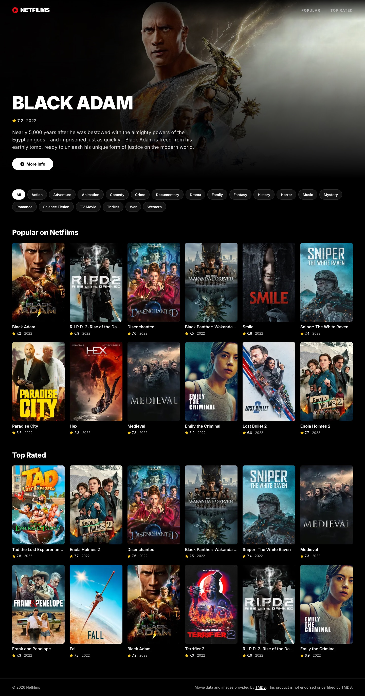
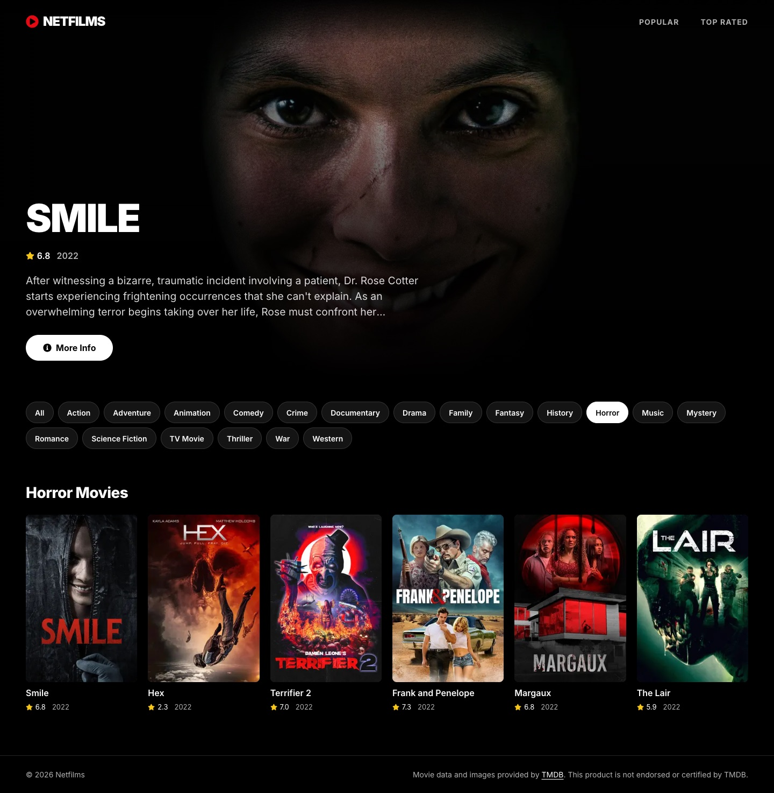
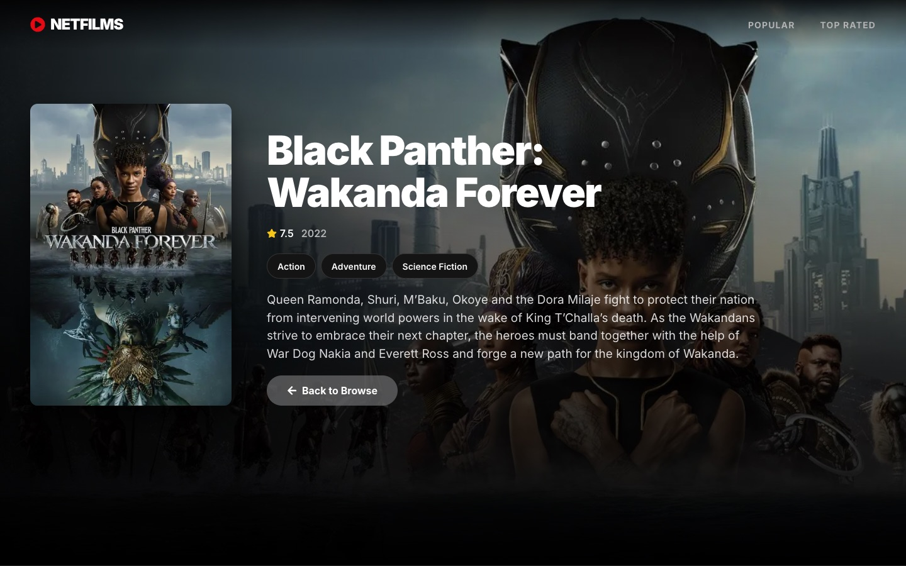
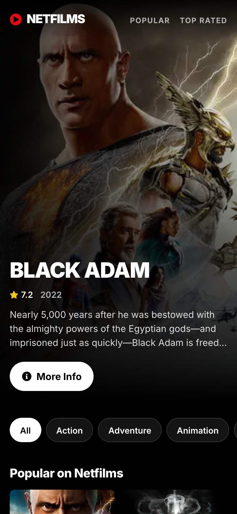
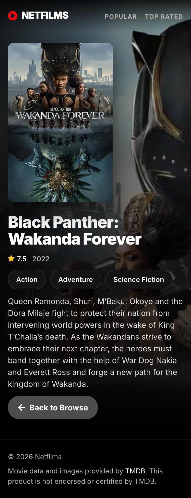

# Netfilms

Next.js App Router, React Server Components ve The Movie Database (TMDB) API kullanılarak geliştirilmiş, Netflix'ten ilham alan bir film keşif uygulaması. 320 piksel genişliğindeki telefonlardan geniş masaüstü ekranlarına kadar tamamen duyarlı (responsive) bir tasarıma sahiptir.



## Özellikler

- **Öne çıkan film alanı:** En popüler filmi öne çıkaran, ekran genişliğini tamamen kaplayan bir arka plan görseli.
- **Popüler ve en yüksek puanlı filmler:** Duyarlı poster ızgarasıyla sunulan film bölümleri.
- **Türlere göre keşif:** TMDB'deki tüm film türleri etiketler şeklinde gösterilir. Mobil cihazlarda etiketler yatay kaydırılabilir; masaüstünde ise birden fazla satıra yerleşir.
- **Film detayları:** Poster, puan, çıkış yılı, süre, slogan, türler ve film özeti.
- **Yükleme iskeletleri (Skeleton):** Tüm rotalarda yükleme göstergeleri, ayrıca özel hata ve 404 sayfaları.
- **Sayfa bazlı SEO meta verileri:** Film sayfalarında Open Graph görselleri de dahil olmak üzere her sayfaya özel SEO meta verileri.
- **Erişilebilirlik:** Anlamsal HTML, klavye odağı stilleri ve `prefers-reduced-motion` desteği.
- **Çevrimdışı veri desteği:** API anahtarı olmadan uygulama, paketle birlikte gelen örnek verilerle çalışır. Böylece ek yapılandırma gerektirmeden kullanılabilir.

## Ekran Görüntüleri

| Tür sayfası | Film detayları |
| --- | --- |
|  |  |

| Ana sayfa (mobil) | Film detayları (mobil) |
| --- | --- |
|  |  |

## Teknoloji Yığını

- [Next.js 16](https://nextjs.org) (App Router, Server Components, Turbopack)
- [React 19](https://react.dev)
- [TypeScript](https://www.typescriptlang.org)
- CSS özel özellikleri (custom properties) üzerinden tanımlanan tasarım değişkenleriyle CSS Modules
- [next/image](https://nextjs.org/docs/app/api-reference/components/image) ve [next/font](https://nextjs.org/docs/app/api-reference/components/font)
- [React Icons](https://react-icons.github.io/react-icons)

## Başlangıç

### Gereksinimler

- Node.js 20.9 veya üzeri

### Kurulum

```bash
git clone https://github.com/<your-username>/nextjs_netflix.git
cd nextjs_netflix
npm install
```

### Ortam Değişkenleri

Örnek dosyayı kopyala ve [TMDB API anahtarını](https://www.themoviedb.org/settings/api) ekle:

```bash
cp .env.example .env.local
```

`.env.local` dosyasına aşağıdaki değişkeni ekle:

```env
TMDB_API_KEY=your_tmdb_api_key
```

`TMDB_API_KEY` boş bırakılırsa uygulama, `lib/tmdb/fixtures` klasöründe bulunan örnek verileri kullanır.

### Komutlar

| Komut | Açıklama |
| --- | --- |
| `npm run dev` | Geliştirme sunucusunu `http://localhost:3000` adresinde başlatır. |
| `npm run build` | Üretim derlemesini oluşturur. |
| `npm start` | Üretim derlemesini çalıştırır. |
| `npm run lint` | ESLint kontrollerini çalıştırır. |
| `npm run typecheck` | TypeScript derleyicisini çıktı üretmeden çalıştırarak tür kontrollerini yapar. |

## Proje Yapısı

```text
app/
  layout.tsx            Kök yerleşim, yazı tipleri ve meta veriler
  page.tsx              Ana sayfa
  genre/[id]/page.tsx   Türe göre filtrelenmiş filmler
  movie/[id]/page.tsx   Film detayları
  loading.tsx           Rota düzeyinde yükleme iskeletleri
  error.tsx             Hata sınırı
  not-found.tsx         404 sayfası

components/             Yeniden kullanılabilir UI bileşenleri
                        (her bileşen için ayrı klasör ve CSS Modules)

lib/
  format.ts             Biçimlendirme yardımcıları
  tmdb/
    index.ts            Ortama göre veri kaynağını seçer
    api-source.ts       ISR önbelleklemesi içeren TMDB REST istemcisi
    fixture-source.ts   Örnek verilerle çalışan çevrimdışı veri kaynağı
    image.ts            TMDB görsel URL'lerini oluşturur
    types.ts            Paylaşılan alan (domain) türleri
```

## Mimari Hakkında Notlar

- **Veri kaynağı soyutlaması:** Sayfalar `MovieSource` arayüzüne bağımlıdır. Canlı TMDB istemcisi ve örnek veri kaynağı bu arayüzü uygular. Böylece sayfaların verinin nereden geldiğini bilmesine gerek kalmaz.
- **Yalnızca sunucuda veri erişimi:** TMDB katmanı `server-only` olarak işaretlenmiştir. Bu sayede API anahtarı istemci paketine dahil edilmez.
- **Önbellekleme:** TMDB yanıtları, `fetch` ve `next.revalidate` kullanılarak her saat yeniden doğrulanır.
- **Duyarlı tasarım:** Akışkan boşluklar ve yazı boyutları için `clamp()` kullanılır. Film posterlerinin ızgarası `auto-fill` sütunlarıyla oluşturulur; böylece sabit ekran genişliği eşiklerine ihtiyaç duyulmaz.

## Atıf

Bu ürün TMDB API'sini kullanmaktadır ancak TMDB tarafından onaylanmamış veya sertifikalandırılmamıştır.

